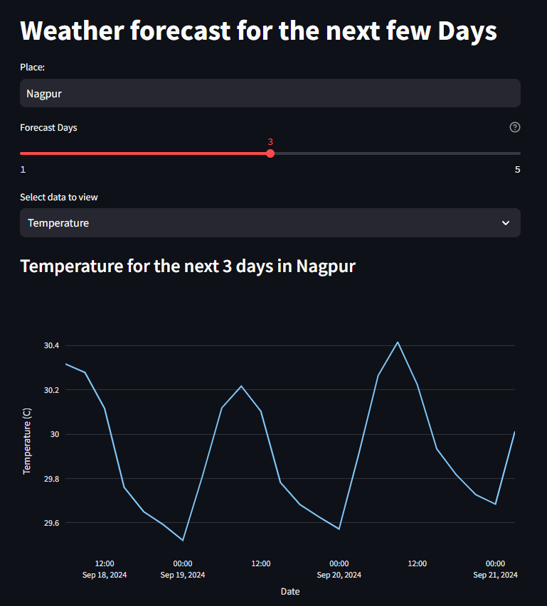

# Weather Forecast App

## Description
A simple weather forecast app built with Streamlit.

## Screenshot


## Prerequisites
- Python 3.6 or higher
- Streamlit

## How to Run the Weather Forecast App

### Step 1: Clone the Repository
Open your terminal and run:
```bash
git clone https://github.com/akash2003git/weather_forecast_app
```

### Step 2: Navigate to the Project Directory
```bash
cd your-repo-name
```

### Step 3: Install Required Packages
```bash
pip install -r requirements.txt
```

### Step 4: Run the app
```bash
streamlit run main.py
```

After running the command, your terminal will show a local URL.
Open this URL in your web browser to view the app.